# 🎙️ Voice-Enabled AI Agent

<div align="center">


**A production-ready voice-powered AI assistant with RAG, real-time weather, and comprehensive monitoring.**

[Features](#-features) • [Quick Start](#-quick-start) • [Architecture](#-system-architecture) • [Deployment](#-deployment) • [Monitoring](#-logging--monitoring)

</div>

---

## 📋 Table of Contents

1. [Overview](#-overview)
2. [Features](#-features)
3. [Quick Start](#-quick-start)
4. [System Architecture](#-system-architecture)
5. [Installation](#-installation)
6. [Configuration](#-configuration)
7. [Usage Guide](#-usage-guide)
8. [API Design](#-api-design)
9. [Deployment](#-deployment)
10. [Logging & Monitoring](#-logging--monitoring)
11. [Scaling Considerations](#-scaling-considerations)
12. [Tools & Technologies](#-tools--technologies)
13. [Performance](#-performance)
14. [Troubleshooting](#-troubleshooting)
15. [Project Structure](#-project-structure)
16. [Contributing](#-contributing)

---

## 🌟 Overview

### What is this project?

A **Voice-Enabled AI Agent** combining three powerful capabilities:

| Capability | Description |
|------------|-------------|
| 📚 **Document Q&A** | Ask questions about your documents using RAG |
| 🎤 **Voice Interaction** | Speak your questions naturally |
| 🌤️ **Real-time Data** | Get live weather for any city |

### How It Works (Simple View)

```mermaid
flowchart LR
    A[🎤 You Speak] --> B[🤖 AI Listens]
    B --> C{What type?}
    C -->|Documents| D[📚 Search Docs]
    C -->|Weather| E[🌤️ Get Weather]
    C -->|General| F[💬 Chat]
    D --> G[🔊 Response]
    E --> G
    F --> G
```



---

## ✨ Features

### Core Features

| Feature | Description | Status |
|---------|-------------|--------|
| 🎤 **Voice Input** | Browser microphone with Whisper STT | ✅ |
| 📚 **Document RAG** | PDF, MD, DOCX support with Pinecone | ✅ |
| 🌤️ **Weather Tool** | Real-time weather via API | ✅ |
| 🧠 **Smart Routing** | Auto-classifies query type | ✅ |
| 📊 **Metrics Dashboard** | Real-time performance tracking | ✅ |
| 🐳 **Docker Ready** | One-command deployment | ✅ |
| 📈 **Monitoring** | Prometheus + Grafana ready | ✅ |
| 🔄 **Async Processing** | Non-blocking operations | ✅ |

---

## 🚀 Quick Start

### 30-Second Setup

```bash
# Clone
git clone https://github.com/yourusername/voice-enabled-AI-agent.git
cd voice-enabled-AI-agent

# Configure
cp .env.example .env
# Add your API keys to .env

# Install & Run
pip install -r requirements.txt
streamlit run app.py
```

### Required API Keys

| Service | Get From | Free Tier |
|---------|----------|-----------|
| Pinecone | [pinecone.io](https://pinecone.io) | ✅ Yes |
| Google AI | [aistudio.google.com](https://aistudio.google.com) | ✅ Yes |
| WeatherAPI | [weatherapi.com](https://weatherapi.com) | ✅ Yes |

---

## 🏗️ System Architecture

### High-Level Architecture

```mermaid
flowchart TB
    subgraph Client["🖥️ Client Layer"]
        WEB[Web Browser]
        MIC[🎤 Microphone]
    end

    subgraph Gateway["🚪 Gateway Layer"]
        NGINX[NGINX Load Balancer]
    end

    subgraph App["⚙️ Application Layer"]
        ST1[Streamlit Instance 1]
        ST2[Streamlit Instance 2]
        STN[Streamlit Instance N]
    end

    subgraph Services["🔧 Service Layer"]
        STT[Whisper STT]
        CLASS[Query Classifier]
        RAG[RAG Pipeline]
        AGENT[Weather Agent]
        METRICS[Metrics Collector]
    end

    subgraph Data["💾 Data Layer"]
        PINE[(Pinecone Vector DB)]
        REDIS[(Redis Cache)]
        LOGS[(Log Storage)]
    end

    subgraph External["🌐 External APIs"]
        GEMINI[Google Gemini]
        WEATHER[WeatherAPI]
    end

    MIC --> WEB
    WEB --> NGINX
    NGINX --> ST1
    NGINX --> ST2
    NGINX --> STN

    ST1 --> STT
    ST1 --> CLASS
    ST1 --> RAG
    ST1 --> AGENT
    ST1 --> METRICS

    CLASS --> GEMINI
    RAG --> PINE
    RAG --> REDIS
    RAG --> GEMINI
    AGENT --> WEATHER
    METRICS --> LOGS
```



### Request Flow Sequence

```mermaid
sequenceDiagram
    participant U as 👤 User
    participant LB as 🚪 Load Balancer
    participant APP as ⚙️ App Server
    participant STT as 🎤 Whisper
    participant CLS as 🧠 Classifier
    participant RAG as 📚 RAG
    participant DB as 💾 Pinecone
    participant LLM as 🤖 Gemini
    participant LOG as 📝 Logger

    U->>LB: Voice/Text Query
    LB->>APP: Route Request
    LOG->>LOG: Log Request

    alt Voice Input
        APP->>STT: Audio Data
        STT-->>APP: Text
        LOG->>LOG: Log STT Time
    end

    APP->>CLS: Classify Query
    CLS->>LLM: Get Type
    LLM-->>CLS: weather/document/general
    LOG->>LOG: Log Classification

    alt Document Query
        APP->>RAG: Process
        RAG->>DB: Vector Search
        DB-->>RAG: Results
        RAG->>LLM: Generate Answer
        LLM-->>RAG: Response
    else Weather Query
        APP->>APP: Call Weather API
    end

    APP-->>LB: Response + Metrics
    LB-->>U: Display
    LOG->>LOG: Log Total Time
```



### Component Architecture


### Data Flow: Document Ingestion

```mermaid
flowchart LR
    subgraph Input["📁 Input"]
        PDF[PDF]
        MD[Markdown]
        DOCX[Word]
    end

    subgraph Process["⚙️ Process"]
        LOAD[Load Documents]
        SPLIT[Split into Chunks]
        EMBED[Generate Embeddings]
    end

    subgraph Store["💾 Store"]
        PINE[(Pinecone)]
    end

    PDF --> LOAD
    MD --> LOAD
    DOCX --> LOAD
    LOAD -->|"Documents"| SPLIT
    SPLIT -->|"2000 char chunks"| EMBED
    EMBED -->|"384-dim vectors"| PINE
```



### Query Classification Logic


---

## 📦 Installation

### Method 1: Local Installation

```bash
# 1. Clone repository
git clone https://github.com/yourusername/voice-enabled-AI-agent.git
cd voice-enabled-AI-agent

# 2. Create virtual environment
python -m venv venv
source venv/bin/activate  # Windows: venv\Scripts\activate

# 3. Install dependencies
pip install -r requirements.txt

# 4. Configure environment
cp .env.example .env
nano .env  # Add your API keys

# 5. Ingest documents (first time)
python main_workflow.py

# 6. Run application
streamlit run app.py
```

### Method 2: Docker Installation

```bash
# 1. Clone and configure
git clone https://github.com/yourusername/voice-enabled-AI-agent.git
cd voice-enabled-AI-agent
cp .env.example .env
nano .env  # Add your API keys

# 2. Run with Docker Compose
docker-compose up --build

# Access at http://localhost:8501
```

### Dependencies

```txt
# Core
langchain-huggingface
langchain-community
langchain-core
langchain-google-genai
langchain-text-splitters

# Vector DB
pinecone-client

# ML/AI
sentence-transformers
torch
transformers

# Document Processing
pypdf

# Web Interface
streamlit

# Utilities
python-dotenv
PyYAML
numpy
nest-asyncio
```

---

## ⚙️ Configuration

### Environment Variables (.env)

```env
# Required
PINECONE_API_KEY=your_pinecone_key
GOOGLE_API_KEY=your_google_key
WEATHER_API_KEY=your_weather_key

# Optional
DOCUMENT_FOLDER_PATH=/app/documents
CHUNK_SIZE=2000
CHUNK_OVERLAP=500
INDEX_NAME=my-custom-index
EMBEDDING_MODEL=sentence-transformers/all-MiniLM-L6-v2
BATCH_SIZE=100
LOG_LEVEL=INFO
REDIS_URL=redis://localhost:6379
```

### Configuration File (config.yaml)

```yaml
document_processing:
  folder_path: /app/documents
  chunk_size: 2000
  chunk_overlap: 500

vector_store:
  index_name: my-custom-index
  embedding_model: sentence-transformers/all-MiniLM-L6-v2
  dimension: 384
  metric: cosine

pinecone:
  cloud: aws
  region: us-east-1

logging:
  level: INFO
  format: json
```

---

## 📖 Usage Guide

### Voice Input

```mermaid
flowchart LR
    A[🎤 Click Record] --> B[🗣️ Speak]
    B --> C[⏹️ Stop]
    C --> D[⏳ Processing]
    D --> E[💬 Response]
```



1. Click **🎤 Record** in sidebar
2. Speak your question
3. Click stop
4. View response with metrics

### Example Queries

| Type | Example |
|------|---------|
| **Document** | "What does chapter 3 say about machine learning?" |
| **Weather** | "What's the weather in Tokyo?" |
| **General** | "Hello, what can you help me with?" |

### Document Ingestion

```bash
# Add your documents
cp your_docs/*.pdf documents/

# Run ingestion
python main_workflow.py
```

---

## 🔌 API Design

### Endpoints (FastAPI Conversion)


| Endpoint | Method | Description |
|----------|--------|-------------|
| `/api/v1/query` | POST | Text query |
| `/api/v1/voice` | POST | Voice query (audio file) |
| `/api/v1/health` | GET | Health check |
| `/api/v1/metrics` | GET | Performance metrics |
| `/api/v1/ingest` | POST | Upload documents |

### Response Format

```json
{
  "success": true,
  "data": {
    "response": "The weather in Tokyo is 22°C.",
    "query_type": "weather",
    "sources": []
  },
  "metrics": {
    "stt_time": 1.23,
    "classification_time": 0.45,
    "retrieval_time": 0.12,
    "response_time": 2.34,
    "total_time": 4.14
  },
  "request_id": "req_abc123"
}
```

### Error Format

```json
{
  "success": false,
  "error": {
    "code": "RATE_LIMIT_EXCEEDED",
    "message": "Too many requests.",
    "retry_after": 60
  },
  "request_id": "req_abc123"
}
```

---

## 🐳 Deployment

### Docker Configuration

#### Dockerfile

```dockerfile
FROM python:3.11-slim

WORKDIR /app

RUN apt-get update && apt-get install -y \
    build-essential curl ffmpeg \
    && rm -rf /var/lib/apt/lists/*

COPY requirements.txt .
RUN pip install --no-cache-dir -r requirements.txt

COPY . .

RUN useradd -m appuser && chown -R appuser:appuser /app
USER appuser

HEALTHCHECK --interval=30s --timeout=10s --start-period=5s --retries=3 \
    CMD curl -f http://localhost:8501/_stcore/health || exit 1

EXPOSE 8501

CMD ["streamlit", "run", "app.py", "--server.port=8501", "--server.address=0.0.0.0"]
```

#### Docker Compose (Production)

```yaml
version: '3.8'

services:
  app:
    build: .
    deploy:
      replicas: 3
      resources:
        limits:
          cpus: '2'
          memory: 4G
    environment:
      - PINECONE_API_KEY=${PINECONE_API_KEY}
      - GOOGLE_API_KEY=${GOOGLE_API_KEY}
      - WEATHER_API_KEY=${WEATHER_API_KEY}
      - REDIS_URL=redis://redis:6379
    depends_on:
      - redis
    networks:
      - app-network
    logging:
      driver: "json-file"
      options:
        max-size: "10m"
        max-file: "3"

  redis:
    image: redis:7-alpine
    command: redis-server --appendonly yes
    volumes:
      - redis-data:/data
    networks:
      - app-network

  nginx:
    image: nginx:alpine
    ports:
      - "80:80"
      - "443:443"
    volumes:
      - ./nginx.conf:/etc/nginx/nginx.conf:ro
    depends_on:
      - app
    networks:
      - app-network

  prometheus:
    image: prom/prometheus:latest
    volumes:
      - ./prometheus.yml:/etc/prometheus/prometheus.yml
    networks:
      - app-network

  grafana:
    image: grafana/grafana:latest
    ports:
      - "3000:3000"
    networks:
      - app-network

networks:
  app-network:
    driver: bridge

volumes:
  redis-data:
```

### Deployment Commands

```bash
# Development
docker-compose up --build

# Production (3 replicas)
docker-compose -f docker-compose.prod.yml up -d

# Scale
docker-compose up -d --scale app=5

# Logs
docker-compose logs -f app

# Health check
curl http://localhost:8501/_stcore/health
```

### CI/CD Pipeline


---

## 📊 Logging & Monitoring

### Logging Architecture


### Log Format (JSON)

```json
{
  "timestamp": "2024-01-15T10:30:00.123Z",
  "level": "INFO",
  "logger": "agentrag",
  "message": "Query completed",
  "request_id": "req_abc123",
  "metrics": {
    "stt_time": 1.23,
    "classification_time": 0.45,
    "retrieval_time": 0.12,
    "response_time": 2.34,
    "total_time": 4.14
  }
}
```

### Metrics Tracked

| Metric | Type | Description |
|--------|------|-------------|
| `request_count` | Counter | Total requests |
| `request_duration_seconds` | Histogram | Processing time |
| `stt_duration_seconds` | Histogram | STT time |
| `retrieval_duration_seconds` | Histogram | Vector search time |
| `llm_duration_seconds` | Histogram | LLM response time |
| `error_count` | Counter | Errors by type |
| `active_connections` | Gauge | Current users |
| `cache_hit_ratio` | Gauge | Cache effectiveness |

### Prometheus Configuration

```python
from prometheus_client import Counter, Histogram, Gauge

REQUEST_COUNT = Counter(
    'voice_agent_requests_total',
    'Total requests',
    ['query_type', 'status']
)

REQUEST_DURATION = Histogram(
    'voice_agent_request_duration_seconds',
    'Request duration',
    ['query_type'],
    buckets=[0.1, 0.5, 1.0, 2.0, 5.0, 10.0]
)

ACTIVE_CONNECTIONS = Gauge(
    'voice_agent_active_connections',
    'Active connections'
)
```

### Grafana Dashboard

```mermaid
flowchart TB
    subgraph Dashboard
        subgraph Row1["📈 Overview"]
            A[Total Requests]
            B[Error Rate]
            C[Avg Response Time]
            D[Active Users]
        end
        subgraph Row2["⏱️ Performance"]
            E[Response Time Distribution]
            F[STT Time Trend]
            G[Retrieval Time Trend]
        end
        subgraph Row3["📊 Breakdown"]
            H[Requests by Type]
            I[Errors by Type]
            J[Cache Hit Rate]
        end
    end
```



### Alerting Rules

| Alert | Condition | Severity |
|-------|-----------|----------|
| High Error Rate | error_rate > 5% (5min) | 🔴 Critical |
| Slow Response | p95 > 10s (5min) | 🟡 Warning |
| Service Down | health fail (1min) | 🔴 Critical |
| High Memory | > 90% (5min) | 🟡 Warning |

---

## 📈 Scaling Considerations

### Scaling Architecture


### Scaling Strategies

| Component | Strategy | Tool |
|-----------|----------|------|
| **App Servers** | Horizontal | Kubernetes HPA |
| **STT** | GPU Instances | AWS G4 |
| **Vector DB** | Managed | Pinecone (auto) |
| **Cache** | Cluster | Redis Cluster |
| **LLM Calls** | Queue | Celery + RabbitMQ |

### Bottleneck Solutions


### Capacity Planning

| Users | Instances | Redis | Latency |
|-------|-----------|-------|---------|
| 1-10 | 1 | 1 node | 3-5s |
| 10-100 | 2-3 | 1 node | 3-5s |
| 100-500 | 5-10 | 3 nodes | 4-6s |
| 500+ | Auto | Cluster | 5-10s |

### Caching Strategy


---

## 🛠️ Tools & Technologies

### Technology Stack


### Tools Summary

| Category | Tool | Purpose | Experience |
|----------|------|---------|------------|
| **Language** | Python 3.11 | Runtime | ⭐⭐⭐⭐⭐ |
| **Framework** | Streamlit | UI | ⭐⭐⭐⭐ |
| **LLM** | LangChain | Orchestration | ⭐⭐⭐⭐⭐ |
| **LLM API** | Gemini | Generation | ⭐⭐⭐⭐ |
| **Vector DB** | Pinecone | Storage | ⭐⭐⭐⭐ |
| **Embeddings** | Sentence Transformers | Vectors | ⭐⭐⭐⭐⭐ |
| **STT** | Whisper | Speech | ⭐⭐⭐⭐ |
| **Cache** | Redis | Performance | ⭐⭐⭐⭐⭐ |
| **Container** | Docker | Deploy | ⭐⭐⭐⭐⭐ |
| **Orchestration** | Kubernetes | Scale | ⭐⭐⭐⭐ |
| **CI/CD** | GitHub Actions | Automation | ⭐⭐⭐⭐⭐ |
| **Monitoring** | Prometheus/Grafana | Observability | ⭐⭐⭐⭐ |

### Why These Tools?

| Tool | Why | Alternatives |
|------|-----|--------------|
| **Pinecone** | Managed, serverless | FAISS, Weaviate |
| **Gemini** | Fast, cheap, quality | GPT-4, Claude |
| **Whisper** | Accurate, open-source | Google STT, Azure |
| **Streamlit** | Rapid prototyping | FastAPI, Gradio |
| **Redis** | Fast, reliable | Memcached |

---

## ⚡ Performance

### Benchmarks

| Operation | Time |
|-----------|------|
| STT (Whisper Tiny) | 0.8-1.5s |
| Query Classification | 0.3-0.5s |
| Vector Retrieval | 0.1-0.3s |
| LLM Response | 1.5-2.5s |
| **Total (Voice)** | **3-5s** |
| **Total (Text)** | **2-3.5s** |

### Optimizations Implemented

| Optimization | Impact |
|--------------|--------|
| Embedding Cache | -40% Pinecone calls |
| Async Processing | +30% throughput |
| Batch Ingestion | -50% ingestion time |
| Model Caching | -80% cold start |

---

## 🔧 Troubleshooting

### Common Issues

| Issue | Solution |
|-------|----------|
| "Index not found" | Run `python main_workflow.py` |
| "API key not found" | Check `.env` file |
| Slow first load | Whisper model downloading (one-time) |
| Out of memory | Reduce `BATCH_SIZE` in config |
| Repeated voice | Update to fixed `app.py` (see repo) |

### Debug Mode

```python
import logging
logging.basicConfig(level=logging.DEBUG)
```

---

## 📁 Project Structure

```
voice-enabled-AI-agent/
├── app.py                    # Main Streamlit app
├── main_workflow.py          # Document ingestion
├── config.yaml               # Configuration
├── requirements.txt          # Dependencies
├── Dockerfile                # Container
├── docker-compose.yml        # Orchestration
├── .env.example              # Env template
├── README.md                 # This file
│
├── src/
│   ├── agentrag.py          # Query processor
│   ├── rag.py               # RAG pipeline
│   └── ...
│
├── workflow/
│   ├── document_ingest.py   # Doc loading
│   ├── document_split.py    # Chunking
│   └── vector_embedding.py  # Embedding
│
└── documents/                # Your docs here
```

---

## 🤝 Contributing

1. Fork the repo
2. Create branch (`git checkout -b feature/xyz`)
3. Commit (`git commit -m 'Add xyz'`)
4. Push (`git push origin feature/xyz`)
5. Open PR

---

## 📜 License

MIT License - see [LICENSE](LICENSE)

---

<div align="center">

**Built with ❤️ using Python, LangChain, and Pinecone**

⭐ Star if helpful!

</div>
