# 🎙️ Voice-Enabled AI Agent

<div align="center">


**An intelligent voice-powered assistant that answers questions from your documents and provides real-time information.**

[Features](#-features) • [Quick Start](#-quick-start) • [Architecture](#-architecture) • [API Reference](#-api-reference) • [Deployment](#-deployment)

</div>

---

## 📋 Table of Contents

- [Overview](#-overview)
- [Features](#-features)
- [Quick Start](#-quick-start)
- [Architecture](#-architecture)
- [Installation](#-installation)
- [Configuration](#-configuration)
- [Usage Guide](#-usage-guide)
- [API Reference](#-api-reference)
- [Deployment](#-deployment)
- [Performance](#-performance)
- [Troubleshooting](#-troubleshooting)
- [Contributing](#-contributing)

---

## 🌟 Overview

### What is this project?

This is a **Voice-Enabled AI Agent** that combines three powerful capabilities:

1. **📚 Document Q&A** - Upload your documents and ask questions in natural language
2. **🎤 Voice Interaction** - Speak your questions instead of typing
3. **🌤️ Real-time Information** - Get live weather data for any city

### Who is this for?

| User Type | Use Case |
|-----------|----------|
| **Researchers** | Query large document collections quickly |
| **Students** | Study materials through voice interaction |
| **Professionals** | Hands-free document retrieval |
| **Developers** | Learn RAG and voice AI implementation |

### How does it work? (Simple Explanation)

```mermaid
flowchart LR
    A[🎤 You Speak] --> B[🤖 AI Listens]
    B --> C{What type of question?}
    C -->|About documents| D[📚 Search Documents]
    C -->|About weather| E[🌤️ Get Weather]
    C -->|General chat| F[💬 Chat Response]
    D --> G[🔊 AI Responds]
    E --> G
    F --> G
```



---

## ✨ Features

### Core Features

| Feature | Description | Status |
|---------|-------------|--------|
| 🎤 **Voice Input** | Speak questions using your microphone | ✅ Ready |
| 📚 **Document RAG** | Answer questions from uploaded PDFs, MD, DOCX | ✅ Ready |
| 🌤️ **Weather Tool** | Real-time weather for any city worldwide | ✅ Ready |
| 🧠 **Smart Routing** | Automatically detects question type | ✅ Ready |
| 📊 **Metrics Dashboard** | View performance metrics in real-time | ✅ Ready |
| 🐳 **Docker Support** | One-command deployment | ✅ Ready |

### Technical Highlights

- **Async Processing** - Non-blocking operations for better performance
- **Embedding Cache** - Reduces redundant API calls
- **Batch Processing** - Efficient document ingestion (100 chunks/batch)
- **Modular Design** - Easy to extend and customize

---

## 🚀 Quick Start

### 30-Second Setup

```bash
# 1. Clone the repository
git clone https://github.com/yourusername/voice-enabled-AI-agent.git
cd voice-enabled-AI-agent

# 2. Create environment file
cp .env.example .env
# Edit .env with your API keys

# 3. Install dependencies
pip install -r requirements.txt

# 4. Run the application
streamlit run app.py
```

### Required API Keys

| Service | Get Key From | Purpose |
|---------|--------------|---------|
| Pinecone | [pinecone.io](https://www.pinecone.io/) | Vector database |
| Google AI | [aistudio.google.com](https://aistudio.google.com/) | Gemini LLM |
| WeatherAPI | [weatherapi.com](https://www.weatherapi.com/) | Weather data |

---

## 🏗️ Architecture

### System Overview

```mermaid
flowchart TB
    subgraph Client["🖥️ Client Layer"]
        UI[Streamlit Web Interface]
        MIC[🎤 Microphone Input]
        TEXT[⌨️ Text Input]
    end

    subgraph Processing["⚙️ Processing Layer"]
        STT[Whisper STT]
        CLASSIFY[Query Classifier]
        ROUTER[Query Router]
    end

    subgraph Services["🔧 Service Layer"]
        RAG[RAG Pipeline]
        WEATHER[Weather Agent]
        FRIENDLY[Friendly Chat]
    end

    subgraph Data["💾 Data Layer"]
        PINECONE[(Pinecone Vector DB)]
        GEMINI[Google Gemini LLM]
        WEATHERAPI[WeatherAPI.com]
    end

    MIC --> UI
    TEXT --> UI
    UI --> STT
    STT --> CLASSIFY
    UI --> CLASSIFY
    CLASSIFY --> ROUTER

    ROUTER -->|"document"| RAG
    ROUTER -->|"weather"| WEATHER
    ROUTER -->|"general"| FRIENDLY

    RAG <--> PINECONE
    RAG <--> GEMINI
    WEATHER <--> WEATHERAPI
    FRIENDLY <--> GEMINI
```



### Query Processing Flow

```mermaid
sequenceDiagram
    participant U as 👤 User
    participant UI as 🖥️ Streamlit
    participant W as 🎤 Whisper
    participant C as 🧠 Classifier
    participant R as 📚 RAG
    participant A as 🌤️ Weather Agent
    participant G as 🤖 Gemini

    U->>UI: Voice/Text Input
    
    alt Voice Input
        UI->>W: Audio Data
        W-->>UI: Transcribed Text
    end

    UI->>C: Query Text
    C->>G: Classify Query
    G-->>C: Query Type

    alt document query
        C->>R: Process with RAG
        R->>R: Embed Query
        R->>R: Search Pinecone
        R->>G: Generate Response
        G-->>R: Answer
        R-->>UI: Response + Metrics
    else weather query
        C->>A: Process with Agent
        A->>A: Call Weather API
        A-->>UI: Weather Data
    else general query
        C->>G: Generate Friendly Response
        G-->>UI: Chat Response
    end

    UI-->>U: Display Response
```



### Document Ingestion Pipeline


### Component Architecture


---

## 📦 Installation

### Prerequisites

- Python 3.11 or higher
- pip package manager
- Microphone (for voice input)
- API keys (Pinecone, Google AI, WeatherAPI)

### Method 1: Local Installation

```bash
# Step 1: Clone repository
git clone https://github.com/yourusername/voice-enabled-AI-agent.git
cd voice-enabled-AI-agent

# Step 2: Create virtual environment
python -m venv venv
source venv/bin/activate  # On Windows: venv\Scripts\activate

# Step 3: Install dependencies
pip install -r requirements.txt

# Step 4: Configure environment
cp .env.example .env
nano .env  # Edit with your API keys
```

### Method 2: Docker Installation

```bash
# Step 1: Clone repository
git clone https://github.com/yourusername/voice-enabled-AI-agent.git
cd voice-enabled-AI-agent

# Step 2: Configure environment
cp .env.example .env
nano .env  # Edit with your API keys

# Step 3: Build and run
docker-compose up --build
```

### Dependencies

```txt
# Core Framework
langchain-huggingface
langchain-community
langchain-core
langchain-google-genai
langchain-text-splitters

# Vector Database
pinecone-client

# ML/AI
sentence-transformers
torch
transformers

# Document Processing
pypdf

# Utilities
python-dotenv
PyYAML
numpy

# Web Interface
streamlit
```

---

## ⚙️ Configuration

### Environment Variables

Create a `.env` file in the project root:

```env
# Required API Keys
PINECONE_API_KEY=your_pinecone_api_key_here
GOOGLE_API_KEY=your_google_api_key_here
WEATHER_API_KEY=your_weather_api_key_here

# Optional Configuration
DOCUMENT_FOLDER_PATH=/app/documents
CHUNK_SIZE=2000
CHUNK_OVERLAP=500
INDEX_NAME=my-custom-index
EMBEDDING_MODEL=sentence-transformers/all-MiniLM-L6-v2
BATCH_SIZE=100
```

### Configuration File (config.yaml)

```yaml
# Document Processing
document_processing:
  folder_path: /app/documents
  chunk_size: 1500
  chunk_overlap: 300

# Vector Store
vector_store:
  index_name: my-custom-index
  embedding_model: sentence-transformers/all-MiniLM-L6-v2
  dimension: 384
  metric: cosine

# Pinecone
pinecone:
  cloud: aws
  region: us-east-1

# Logging
logging:
  level: INFO
```

### API Key Setup Guide

#### 1. Pinecone API Key


1. Visit [pinecone.io](https://www.pinecone.io/)
2. Create a free account
3. Create a new project
4. Navigate to **API Keys** in the sidebar
5. Copy your API key
6. Add to `.env` as `PINECONE_API_KEY`

#### 2. Google AI (Gemini) API Key

1. Visit [aistudio.google.com](https://aistudio.google.com/)
2. Sign in with Google account
3. Click **Get API Key**
4. Create new API key
5. Add to `.env` as `GOOGLE_API_KEY`

#### 3. WeatherAPI Key

1. Visit [weatherapi.com](https://www.weatherapi.com/)
2. Sign up for free account
3. Go to Dashboard
4. Copy your API key
5. Add to `.env` as `WEATHER_API_KEY`

---

## 📖 Usage Guide

### Starting the Application

```bash
# Start the web interface
streamlit run app.py

# The app will open at http://localhost:8501
```

### Using Voice Input


1. Click the **🎤 Record** button in the sidebar
2. Speak your question clearly
3. Click stop when finished
4. Wait for the AI response

### Using Text Input

1. Type your question in the chat input at the bottom
2. Press Enter or click Send
3. View the response in the chat

### Example Queries

| Query Type | Example Questions |
|------------|-------------------|
| **Document** | "What does the document say about machine learning?" |
| **Document** | "Summarize the key points from chapter 3" |
| **Weather** | "What's the weather in New York?" |
| **Weather** | "Will it rain in London today?" |
| **General** | "Hello, what can you help me with?" |

### Ingesting Documents

```bash
# Add documents to the /documents folder
cp your_documents/*.pdf documents/

# Run the ingestion workflow
python main_workflow.py
```

Supported formats:
- PDF (`.pdf`)
- Markdown (`.md`)
- Word Documents (`.docx`)

---

## 🔌 API Reference

### Core Functions

#### `process_query(query: str, return_metrics: bool = False)`

Main entry point for processing user queries.

```python
from src.agentrag import process_query

# Simple usage
response = await process_query("What is machine learning?")
print(response)

# With metrics
response, metrics = await process_query("What is machine learning?", return_metrics=True)
print(f"Response: {response}")
print(f"Total time: {metrics.total_time:.2f}s")
```

**Parameters:**
| Parameter | Type | Default | Description |
|-----------|------|---------|-------------|
| `query` | `str` | Required | User's question |
| `return_metrics` | `bool` | `False` | Return performance metrics |

**Returns:**
- `str` - Response text (if `return_metrics=False`)
- `Tuple[str, QueryMetrics]` - Response and metrics (if `return_metrics=True`)

---

#### `classify_query(query: str) -> str`

Classifies query into category for routing.

```python
from src.agentrag import classify_query

query_type = await classify_query("What's the weather in Paris?")
print(query_type)  # Output: "weather"
```

**Returns:** `"weather"` | `"document"` | `"general"`

---

#### `rag_search(query: str) -> Tuple[str, float]`

Searches vector database for relevant documents.

```python
from src.agentrag import rag_search

context, score = await rag_search("machine learning algorithms")
print(f"Relevance score: {score}")
print(f"Context: {context[:200]}...")
```

**Returns:**
- `context` - Combined text from relevant documents
- `score` - Highest relevance score (0-1)

---

#### `get_weather(city: str) -> str`

LangChain tool for fetching weather data.

```python
from src.agentrag import get_weather

weather_info = get_weather("Tokyo")
print(weather_info)
```

**Returns:** Formatted weather information string

---

### QueryMetrics Class

```python
class QueryMetrics:
    classification_time: float  # Time to classify query
    retrieval_time: float       # Time to search vectors
    response_time: float        # Time to generate response
    total_time: float           # Total processing time
    query_type: str             # Classified query type
```

---

## 🐳 Deployment

### Docker Deployment

#### Build and Run

```bash
# Build the image
docker build -t voice-ai-agent .

# Run the container
docker run -p 8501:8501 \
  -e PINECONE_API_KEY=your_key \
  -e GOOGLE_API_KEY=your_key \
  -e WEATHER_API_KEY=your_key \
  -v $(pwd)/documents:/app/documents \
  voice-ai-agent
```

#### Docker Compose

```bash
# Start all services
docker-compose up -d

# View logs
docker-compose logs -f

# Stop services
docker-compose down
```

### Production Deployment Architecture


### Environment-Specific Configuration

| Environment | Configuration |
|-------------|---------------|
| **Development** | Local Whisper, Debug logging, Single instance |
| **Staging** | Local Whisper, Info logging, 2 instances |
| **Production** | Whisper API, Warning logging, Auto-scaling |

---

## 📊 Performance

### Metrics Tracked


| Metric | Description | Target |
|--------|-------------|--------|
| **STT Time** | Speech-to-text conversion | < 2s |
| **Classification Time** | Query type detection | < 0.5s |
| **Retrieval Time** | Vector search | < 0.3s |
| **Response Time** | LLM generation | < 3s |
| **Total Time** | End-to-end | < 6s |

### Optimization Strategies

```mermaid
flowchart LR
    subgraph Current["✅ Implemented"]
        A[Embedding Cache]
        B[Async Processing]
        C[Batch Ingestion]
        D[Model Caching]
    end

    subgraph Future["🔮 Recommended"]
        E[Redis Cache]
        F[Whisper API]
        G[Connection Pooling]
        H[Queue System]
    end
```



### Benchmarks

| Operation | Small Doc Set | Large Doc Set |
|-----------|---------------|---------------|
| Document Ingestion | ~2 min (100 pages) | ~20 min (1000 pages) |
| Query Response | 2-4 seconds | 3-6 seconds |
| Voice Processing | 0.5-2 seconds | 0.5-2 seconds |

---

## 🔧 Troubleshooting

### Common Issues

#### 1. Pinecone Index Error

```
Error: Index 'my-custom-index' not found
```

**Solution:**
```bash
# Run the ingestion workflow first
python main_workflow.py
```

#### 2. API Key Not Found

```
Error: PINECONE_API_KEY not found in environment variables
```

**Solution:**
```bash
# Check .env file exists
cat .env

# Reload environment
source .env  # Linux/Mac
# Or restart your terminal
```

#### 3. Whisper Model Loading Slow

**Solution:** The first load downloads the model. Subsequent loads use cache.

```python
# Use smaller model for faster loading
model="openai/whisper-tiny"  # Fastest
model="openai/whisper-base"  # Better accuracy
```

#### 4. Out of Memory Error

**Solution:**
```bash
# Reduce batch size in config.yaml
processing:
  batch_size: 50  # Reduce from 100
```

### Debug Mode

```python
# Enable verbose logging
import logging
logging.basicConfig(level=logging.DEBUG)
```

### Health Check

```bash
# Check all services
python -c "
from pinecone import Pinecone
import os
pc = Pinecone(api_key=os.getenv('PINECONE_API_KEY'))
print('Pinecone:', 'OK' if pc.list_indexes() else 'FAIL')
"
```

---

## 📁 Project Structure

```
voice-enabled-AI-agent/
│
├── 📄 app.py                    # Streamlit web application
├── 📄 main_workflow.py          # Document ingestion entry point
├── 📄 config.yaml               # Configuration file
├── 📄 requirements.txt          # Python dependencies
├── 📄 Dockerfile                # Container definition
├── 📄 docker-compose.yml        # Container orchestration
├── 📄 .env.example              # Environment template
│
├── 📁 src/                      # Source code
│   ├── 📄 agentrag.py          # Main query processor
│   ├── 📄 rag.py               # RAG implementation
│   ├── 📄 rag2.py              # Simplified RAG
│   ├── 📄 split_document.py    # Document splitting
│   ├── 📄 ingest_document.py   # Document loading
│   ├── 📄 embeded_vector_store.py  # Vector storage
│   └── 📄 voice_chatbot.py     # Alternative voice UI
│
├── 📁 workflow/                 # Pipeline modules
│   ├── 📄 __init__.py
│   ├── 📄 config.py            # Workflow configuration
│   ├── 📄 document_ingest.py   # Ingestion workflow
│   ├── 📄 document_split.py    # Splitting workflow
│   └── 📄 vector_embedding.py  # Embedding workflow
│
└── 📁 documents/                # Document storage
    └── (your PDF/MD/DOCX files)
```

---

## 🛡️ Security

### Current Measures

- ✅ API keys stored in environment variables
- ✅ `.gitignore` excludes sensitive files
- ✅ Input validation on queries

### Production Recommendations

- [ ] Implement JWT authentication
- [ ] Add rate limiting
- [ ] Enable HTTPS/TLS
- [ ] Use secrets management (Vault, AWS Secrets Manager)
- [ ] Add audit logging
- [ ] Implement input sanitization

---

## 🤝 Contributing

### How to Contribute

1. Fork the repository
2. Create feature branch (`git checkout -b feature/amazing-feature`)
3. Commit changes (`git commit -m 'Add amazing feature'`)
4. Push to branch (`git push origin feature/amazing-feature`)
5. Open a Pull Request

### Development Setup

```bash
# Clone your fork
git clone https://github.com/yourusername/voice-enabled-AI-agent.git

# Install dev dependencies
pip install -r requirements-dev.txt

# Run tests
pytest tests/

# Run linting
flake8 src/
```

---

## 📜 License

This project is licensed under the MIT License - see the [LICENSE](LICENSE) file for details.

---

## 🙏 Acknowledgments

- [LangChain](https://langchain.com/) - LLM framework
- [Pinecone](https://pinecone.io/) - Vector database
- [Google AI](https://ai.google.dev/) - Gemini LLM
- [Hugging Face](https://huggingface.co/) - Transformers & Whisper
- [Streamlit](https://streamlit.io/) - Web interface

---

## 📞 Support

- 📧 Email: your.email@example.com
- 🐛 Issues: [GitHub Issues](https://github.com/yourusername/voice-enabled-AI-agent/issues)
- 💬 Discussions: [GitHub Discussions](https://github.com/yourusername/voice-enabled-AI-agent/discussions)

---

<div align="center">

**Built with ❤️ by [Your Name]**

⭐ Star this repo if you find it helpful!

</div>
